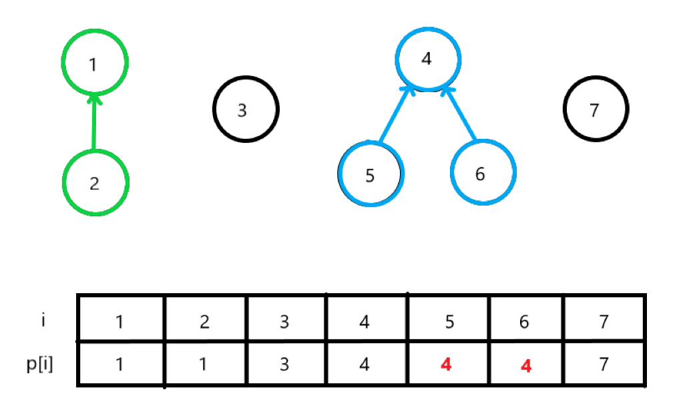

#### 시간복잡도 `O(N+M)`
>
>   Checkpoint:  편의상 1번부터 N번 사람까지 번호가 붙어져 있고,두 사람은 서로를 알고 있는 관계일 수 있고, 아닐 수 있다.
>   창용 마을의 몇 개의 무리 수
>
>
>   관계찾기, 무리(덩어리) 수-> 유니온-파인드

유니온-파인드 구조만 알고있다면 쉽게 구현 가능


유니온-파인드: 두 노드가 같은 집합에 속하는지 판별하는 알고리즘

`parent [인덱스가 자식] = 부모가 저장될 값
`

필수 구현
- setPaent(int N) -> 자기자신을 부모로 둠
- Find(int x) -> x의 최상단 부모찾기
- Union(int a, int b) -> a와 b를 같은 집합으로 만들기

여기서 좀 더 최적화가 필요함. Find할 때 ***경로를 압축***<br>
`return parent[x]= find(parent[x]) `


**수더코드**<br>
Find 구현
```
function find(x):
  if parent[x] == x:
      return x
  else:
      // 경로 압축: 부모를 루트로 바로 변경
      parent[x] = find(parent[x]) 
      return parent[x]
```

Union 구현
```
function union(x, y):
    rootX = find(x)
    rootY = find(y)
    
    if rootX != rootY:
        // rootY를 rootX의 자식으로 설정 (임의로 합침)
        parent[rootY] = rootX 
```

여기서 그룹의 수를 찾는게 주 목적이니까<br>
마지막에 for문을 통해서 `Find`로 부모를 찾는 법이 있음<br>
이때는 `visited[n]`만큼 이미 방문한 곳인지 체크해서 `count`를 세면 됨.<br>
<br>
다른방법은 처음부터 n개에서 그룹을 지을때마다 자기자신을 제외하는 것.<br> =>이 방법이 코드가 더 깔끔해짐. `Union` 함수에서 합집합 만드는 부분에 `count--` 한줄 추가 해주면됨.

---
후기: DFS/BFS로도 풀이가능 => 그래프 문제라<br>
인접리스트로 만들어서 접근하면 됨 <br>
시간복잡도도 동일함. 메모리 사용량은 유니온-파인드 구현이 더 효율적

